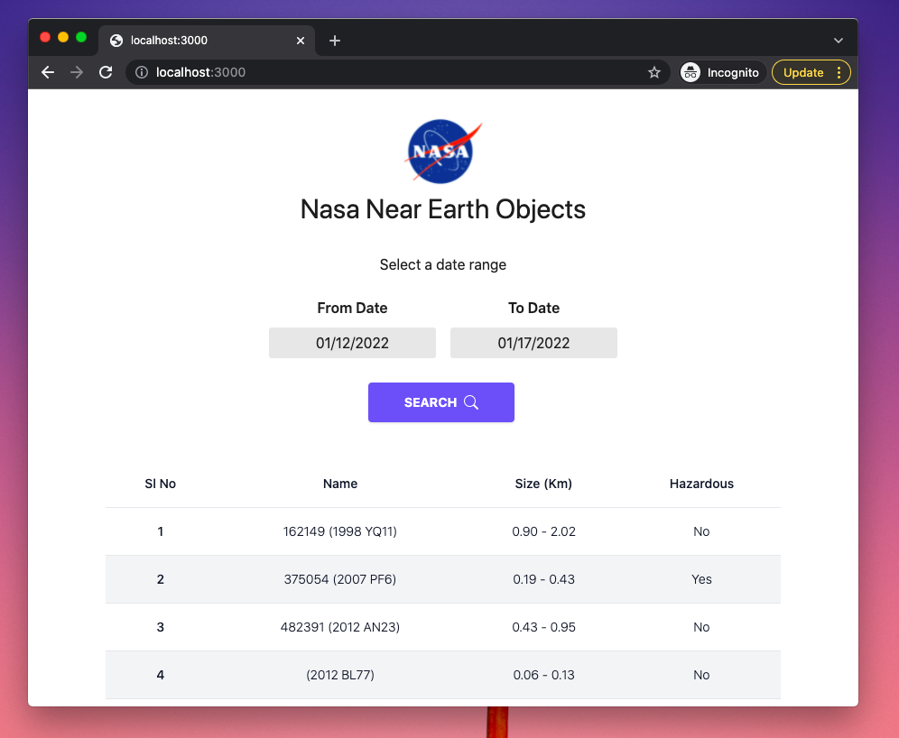

# Nasa Near Earth Objects App 

An app to search and display near earth objects using the Nasa Neo API

[Live Demo](https://nasa-neo-app-is65s14y1-anusreesubash.vercel.app/)

## Demo


## Dependencies
* NodeJS >= v10

## Installation
```bash
$ npm install
```

## Run
Build files and start local server in watch mode:
```js
$ npm run dev
```
This will open the browser at `http://localhost:3000/`.

## License
[MIT](LICENSE)
